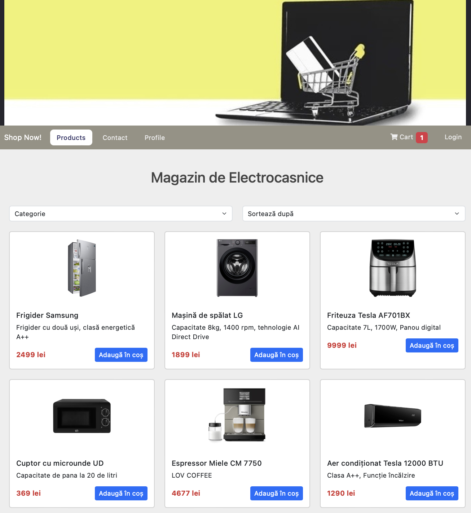
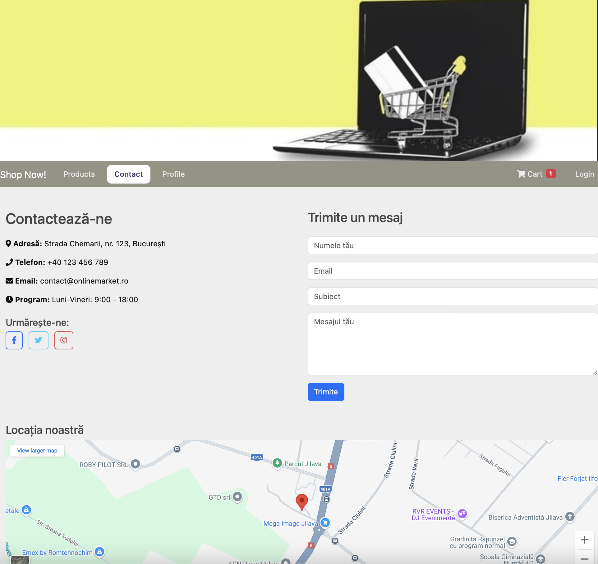
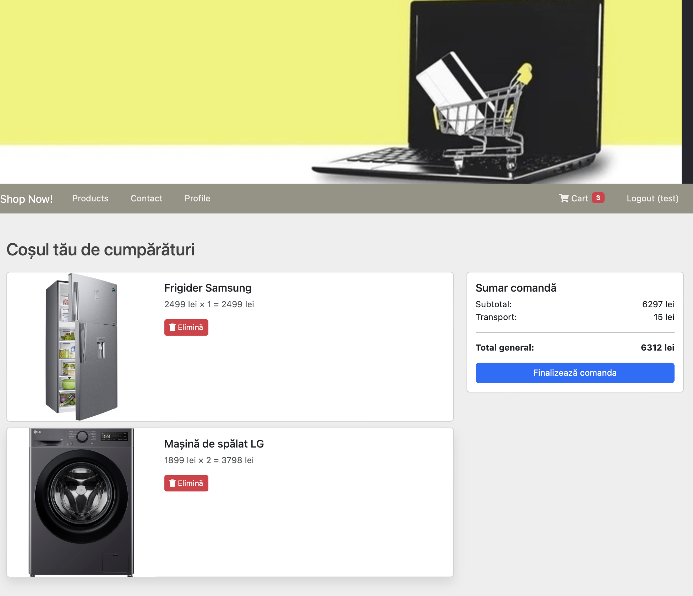
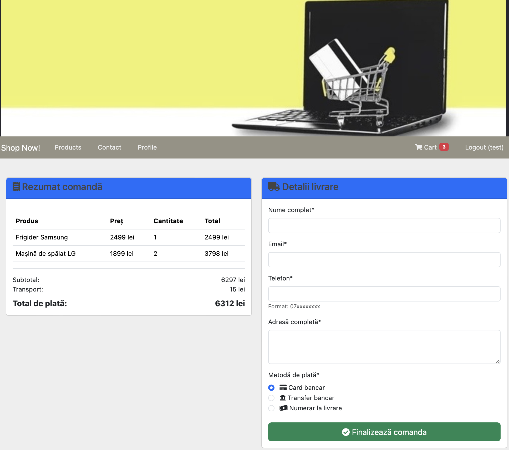

# Traistaru Dragos-Andrei 313CA #

# 🛒 Shopping Site

## Description  
This project is an online shopping website developed using Flask, allowing users to browse products, add items to the shopping cart, and place orders.

## Project Structure

### Main Files  
- `server.py` – The main Flask application containing all routes and backend logic  
- `Dockerfile` – Configuration for containerizing the application using Docker  

### `templates/` Directory  
Contains all HTML templates for the application:  
- `_base.html` – Base template defining the common layout for all pages  
- `index.html` – Homepage displaying the product list  
- `cart.html` – Shopping cart page  
- `checkout.html` – Checkout page with the delivery form  
- `login.html` – Login page  
- `account-details.html` – Account details management page  
- `order_confirmation.html` – Order confirmation page after placing an order  
- `second.html` – Secondary page with contact information  
- `404.html` – Error page for non-existent routes  

### `public/` Directory  
Contains all static resources for the application:  
- `bootstrap/` – CSS and JavaScript files for the Bootstrap framework  
- `images/` – Images used in the application  
- `produse/` – Product images for the shop  
- `style.css` – Custom CSS for the application  

## Features  
- User authentication  
- Product browsing  
- Shopping cart  
- Order processing  
- User account management  
- Contact form messaging system  
- Responsive interface  

## Login Credentials  
- **Username:** `test`  
- **Password:** `test123`
